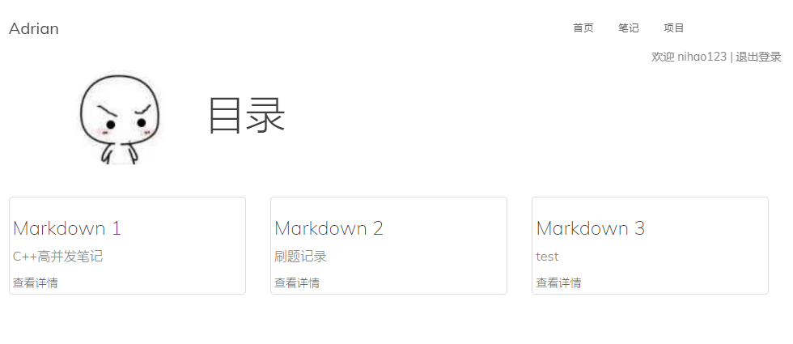
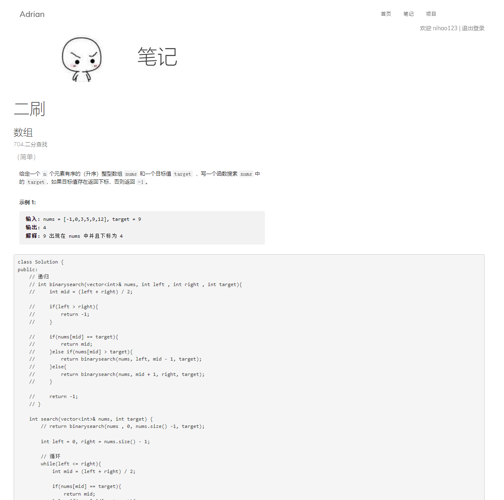
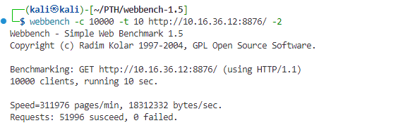

# 效果

# 安装与配置  

## 打开端口（设置防火墙）  

sudo iptables -L  

sudo iptables -A INPUT -p tcp --dport 8876 -j ACCEPT  

## 安装MYSQL、mysql库（ mysql连接库 #include <mysql/mysql.h> )
sudo apt-get install mysql-server  
sudo apt-get install libmysqlclient-dev  
sudo apt-get install default-libmysqlclient-dev  

sqlconnRAII: 构造即初始化(注意是sql 而不是sql池)  

## 数据库操作： 

添加用户:  
 //%是通配符 表示所有地址连接webserver都可以 也可以写localhost  
CREATE USER 'username'@'%' IDENTIFIED BY 'password';  

赋予权限:  
GRANT ALL PRIVILEGES ON webserver.* TO 'web_admin'@'%';  

刷新:  
FLUSH PRIVILEGES;  

登录： 
mysql -u username -p   

创建表： 
create table user(  
    username varchar(30);  
    passwd varchar(30);  
);  

## 安装redis、hiredis  
sudo apt-get update  
sudo apt-get install redis-server  
sudo apt-get install libhiredis-dev  

## 安装cmark  
github:https://github.com/commonmark/cmark   
链接：-L "/cmark_path/lib"  

# TODO  

##### · 环境配置  

##### · 添加Cookie、Session登录验证模块  

##### · 实现Redis数据库储存Cookie信息  

##### · 实现markdown解析成HTML并发送给客户端  

##### · 完善Heaptimer小顶堆计时器的功能  

# 压力测试  

  

测试环境：Kali Linux 6.1.0 x86_64 	内存：8G  

测试指令：webbench -c 10000 -t 10 http://ip:port/ -2  

[Web Bench Homepage (tiscali.cz)](http://home.tiscali.cz/~cz210552/webbench.html)  

# 后续 

##### ·留言功能
##### ·markdown上传
##### ·预防SQL注入

# 参考  

[markparticle/WebServer: C++ Linux WebServer服务器 (github.com)](https://github.com/markparticle/WebServer)  
