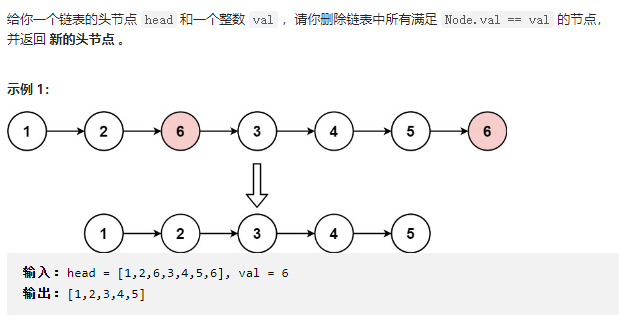
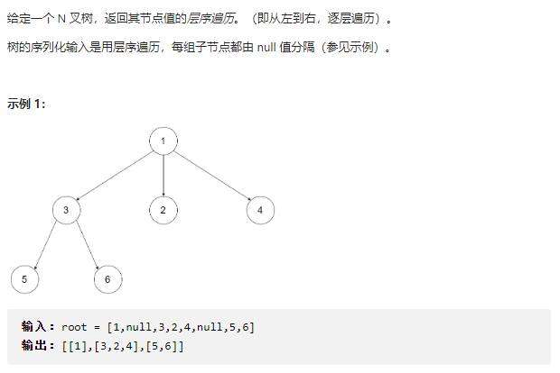

## 二刷

### 数组

##### 704.二分查找 

（简单）


```C++
class Solution {
public:
    // 递归
    // int binarysearch(vector<int>& nums, int left , int right , int target){
    //     int mid = (left + right) / 2;

    //     if(left > right){
    //         return -1;
    //     }

    //     if(nums[mid] == target){
    //         return mid;
    //     }else if(nums[mid] > target){
    //         return binarysearch(nums, left, mid - 1, target);
    //     }else{
    //         return binarysearch(nums, mid + 1, right, target);
    //     }

    //     return -1;
    // }
    
    int search(vector<int>& nums, int target) {
        // return binarysearch(nums , 0, nums.size() -1, target);

        int left = 0, right = nums.size() - 1;
        
        // 循环
        while(left <= right){
            int mid = (left + right) / 2;
            
            if(nums[mid] == target){
                return mid;
            }else if(nums[mid] > target){
                right = mid - 1;
            }else{
                left = mid + 1;
            }
        }

        return -1;
    }
};
```

**总结：**两种写法

常用写法**[left, right] ** left <= right 保证：left=right的时候 还是能计算一次mid (left == right有意义)。 right = mid - 1 而不是 right = mid 保证：left = right的时候不进入死循环。

**[left, right)** left < right (left == right 没有意义) right = mid 而不是mid-1 因为不包含右区间 nums[right] 实际上算到了nums[right - 1]  


##### 35.搜索插入位置

（简单）


```C++
class Solution {
public:
    int searchInsert(vector<int>& nums, int target) {
        int left = 0, right = nums.size() - 1;
        
        
        while(left <= right){
            int mid = (left + right) / 2;

            if(nums[mid] == target){
                return mid;
            }
            
            if(left == right){
                if(nums[left] > target){
                    return left;
                }else{
                    return left + 1;
                }
            }

            if(nums[mid] > target){
                right = mid;
            }else{
                left = mid + 1;
            }

        }

        return -1;
    }
};
```

**总结：**使用二分查找法查找，有可能出现left == right 的时候，  这个时候就要判断目标值大于nums[mid] 还是 小于nums[mid] 如果target < nums[mid] 那么 直接return mid 就行了（相当于替换现在的mid位置）

**注意**：right = mid 而不是mid - 1 是因为目标值可能不存在 nums中， left == right的时候需要单独判断。如果直接right = mid - 1的话可能会跳过查询的位置。[1, 3] 0 （上一道题可以 right = mid - 1 是因为 既然nums[mid] 不是目标值了，那么就可以right = mid - 1，反正最后找不到的话返回的都是-1，而这道题有可能nums[mid] 就是索引值， 不一定需要target == nums[mid]）


##### 34.在排序数组中查找第一个和最后一个位置 

（中等）


```C++
class Solution {
public:
    vector<int> searchRange(vector<int>& nums, int target) {
        vector<int> result(2, -1);
        int left = 0, right = nums.size() - 1;
        
        while(left <= right){
            int mid = (left + right) / 2;
            
            // 查找target的后一个元素
            if(nums[mid] == target){
                left = mid + 1;
            }else if(nums[mid] > target){
                right = mid - 1;
            }else {
                left = mid + 1;
            }
        }
        
        // 判断nums[left - 1] 是否为target
        if(left > 0 && nums[left - 1] == target){
            result[1] = left - 1;
        }


        for(int i = left - 1; i >= 0 ; i--){
            if(nums[i] == target){
                result[0] = i;
            }else{
                break;
            }
        }

        return result;
    }
};
```

**总结：**二分查找当nums[mid] == target的时候，不直接return，而是将left = mid + 1； 这样就可以得到最后一个target的位置。然后再往前遍历，找到第一个target的位置。


##### 69.x的平方根

(简单)


```C++
// 爆破
// class Solution {
// public:
//     int mySqrt(int x) {
//         for(long i = 0 ; i <= x / 2; i++){
//             if(i * i <= x && (i+1) * (i+1) > x){
//                 return i;
//             }
//         }

//         return 1;
//     }
// };

// 二分查找法
class Solution {
public:
    int mySqrt(int x) {
        int left = 0, right = x - 1;

        if(x == 0){
            return 0;
        }

        while(left <= right){
            long mid = (left + right) / 2;
            
            if(mid * mid <= x && (mid + 1) * (mid + 1) > x){
                return mid;
            }else if(mid * mid > x){
                right = mid - 1;
            }else{
                left = mid + 1;
            }
        }

        return 1;
    }
};
```

**总结：**这种升序的序列可以考虑二分查找法， x = 0的时候需要注意，right  <  0。


##### 367.有效的完全平方数

（简单）


```C++
class Solution {
public:
    bool isPerfectSquare(int num) {
        int left = 0 , right = num;
        
        while(left <= right){
            long mid = (left + right) / 2;
            
            if(mid * mid == num){
                return true;
            }else if(mid * mid > num){
                right = mid - 1;
            }else{
                left = mid + 1;
            }
        }

        return false;

    }
};
```

**总结：**这种升序的序列可以考虑二分查找法。


##### 27.移除元素

（简单）


```C++
class Solution {
public:
    int removeElement(vector<int>& nums, int val) {
        int slow = 0, fast = 0;
        
        while(fast != nums.size()){
            if(nums[fast] != val){
                nums[slow] = nums[fast];
                slow++;
            }
            fast++;
        }

        nums.resize(slow);

        return slow;
    }
};
```

**总结：**删除数组中元素一定要考虑双指针！

**注意**： fast != nums.size() 而不是 nums.size() - 1 因为需要遍历到最后一个元素。


##### 283.移动零

（简单）


```C++
class Solution {
public:
    void moveZeroes(vector<int>& nums) {
        int slow = 0, fast = 0;

        while(fast != nums.size()){
            if(nums[fast] != 0){
                nums[slow++] = nums[fast];
            }
            fast++;
        }
        
        for(int i = slow; i < nums.size(); i++){
            nums[i] = 0;
        }

    }
};
```

**总结：**和上题一样，考虑双指针。


##### 844.比较退格字符串

（简单）


```
class Solution {
public:
    bool backspaceCompare(string s, string t) {
        // int i = s.size() - 1, j = t.size() - 1;

        for(int i = 0; i < s.size(); ){
            if(s[i] == '#'){
                s.erase(i,1);
                i--;
                if(i >= 0){
                    s.erase(i,1);
                }else{
                    i=0;
                }
            }else{
                i++;
            }
        }

        for(int i = 0; i < t.size(); ){
            if(t[i] == '#'){
                t.erase(i,1);
                i--;
                if(i >= 0){
                    t.erase(i,1);
                }else{
                    i=0;
                }
            }else{
                i++;
            }
        }
        
        return s == t;

    }                       
};
```

**总结：**该题细节比较多，特别是考虑到开头的时候，如果#在开头，那么需要删除并且将i = -1还原成i = 0。   


##### 977.有序数组的平方

(简单)


```C++
class Solution {
public:
    vector<int> sortedSquares(vector<int>& nums) {
        vector<int> result(nums.size(), 0);
        
        int left = 0, right = nums.size() - 1;
        int i = nums.size() - 1;


        while(i >= 0){
            if(nums[left] * nums[left] <= nums[right] * nums[right]){
                result[i] = nums[right] * nums[right];
                right--;
            }else{
                result[i] = nums[left] * nums[left];
                left++;
            }
            i--;
        }

        return result;
    }
};
```

**总结：**正负号需要考虑清楚，[-4,-3,-1,0,1] 和[-4,-3,-1,0,1,5] 可能不一样  直接在nums上操作很麻烦。


##### 209.长度最小子数组

(中等)


```C++
class Solution {
public:
    int minSubArrayLen(int target, vector<int>& nums) {
        int sum = 0;

        int left = 0, right = 0;
        
        int result = INT_MAX;
        nums.resize(nums.size() + 1, 0);

        while(right != nums.size() ){
            if(sum < target){
                sum += nums[right];
                right++;
            }else{
                sum -= nums[left];
                left++;
            }

            if(sum >= target){
                result = result < right - left? result : right - left;
            }
        }

        if(result == INT_MAX){
            return 0;
        }


        return result;
    }
};
```

**总结：**连续子数组，考虑使用滑动窗口，定义两个指针和sum，如果sum<target那么移动右边，sum>target移动左边。

**注意：** 代码中sum + =nums[right]之后，再进行right++，说明sum = [left, right)，需要扩充nums的长度，因为需要处理right = nums.size() 的情况， 如[2,3,1,2,4,3] target=7， 那么当 right移动到6的时候，还需要进行裁剪（left还需要移动），不能直接退出while循环。


##### 904.水果成篮

(中等)


```C++
class Solution {
public:
    int totalFruit(vector<int>& fruits) {
        int result = 0;
        vector<int> basket(2,-1);
        
        int left = 0, right = 0;

        if(fruits.size() <= 2){
            return fruits.size();
        }

        while(right != fruits.size()){
            
            if(fruits[right] == basket[0] || fruits[right] == basket[1]){
                right++;
            }else{
                left = right-1;
                while(left >= 0 && fruits[left] == fruits[right - 1]){
                    left--;
                }
                left += 1;
                basket[0] = fruits[left];
                basket[1] = fruits[right];
            }

            result = max(result, right - left);
            
        }

        return result;
    }
};
```

**总结：**该题考虑滑动窗口，细节较多。考虑到摘的水果是否在篮里，定义篮子basket。如果是新的种类，那么找到前一个种类的index（用left = right - 1，然后向前遍历找到）

**注意：** 找到前一个水果的index，需要考虑到left 是否 >0 ，并且需要 +1。


##### 76.最小覆盖子串

(困难**)


```C++
class Solution {
public:

    string minWindow(string s, string t) {
        int left = 0, right = 0;
        unordered_map<char, int> mp;
        int size = INT_MAX;
        int start = 0;
        int count = t.size();

        string result;
        
        for(auto &c:t){
            mp[c]++;
        }

        s.resize(s.size() + 1, '0');

        while(right != s.size()){
            char c = s[right];
            
            if(mp[c] > 0){
                count--;
            }
            mp[c]--;

            if(count == 0){
                while(left < right && mp[s[left]] < 0){
                    mp[s[left++]]++;
                }
                
                if(right - left < size){
                    size = right - left + 1;
                    start = left;
                }
                mp[s[left]]++;
                count++;
                left++;
            }
            
            right++;

        }
    
        return size == INT_MAX? "" : s.substr(start,size);

    }
};
```

**总结：**采用滑动窗口，并采用计数器count，来判断是否t中的字符串都在滑动窗口中。

**注意：**移动left的时候，当我们移动left，刚好mp[s[left]] = 0的时候， 这个时候刚好滑动窗口中包含t，所以顺序是：

1、移动滑动窗口

2、收集结果

3、再次移动left（为了使滑动窗口刚好去掉一个t中的字符 或者说  使count != 0）


##### 59.螺旋数组

(中等)


```C++
class Solution {
public:
    vector<vector<int>> generateMatrix(int n) {
        vector<vector<int>> result(n, vector<int>(n,0));
        
        int startx = 0, starty = 0;
        int loop = n / 2;
        int offset = 1;
        int count = 1;
        int i,j;
    
        while(loop--){
            i = startx;
            j = starty;

            // 左->右
            for( j = starty; j < n - offset ; j++){
                result[i][j] = count++;
            }

            // 上->下
            for( i = startx ; i < n - offset; i++ ){
                result[i][j] = count++;
            }

            // 右->左
            for( ; j > startx; j--){
                result[i][j] = count++;
            }

            // 下->上
            for( ; i > startx; i--){
                result[i][j] = count++;
            }
            
            startx++;
            starty++;
            offset++;
        }

        if(n % 2 != 0){
            result[n/2][n/2] = count++;
        }
        
        return result;
    }
};
```

**总结：**循环次数loop = n / 2，记录位置startx ， starty，偏移量offset = 1。

**注意：** 1、如果n是奇数的话，需要对中间那个位置赋值，result[n/2]\[n/2] = count++。

​			2、注意在转圈的时候，取 n - offset（取左不取右 n = 3 offset = 1  那么只能取到索引是1，而不是2）


##### 54.螺旋矩阵

（中等）


```C++
class Solution {
public:
    vector<int> spiralOrder(vector<vector<int>>& matrix) {
        vector<int> result;
        int startx= 0, starty = 0;

        // m 行   n列
        int m = matrix.size(), n = matrix[0].size();

        // 因为m n不一样 所以不能用offset来记录偏移量 需要自己计算末尾到哪里

        int loop = min((m+1)/2, (n+1)/2);
        int i , j;


        while(loop--){

            int endX = m - startx - 1, endY = n - starty - 1;

            // →  需要遍历开始和结尾是因为，如果当前只有（只剩）一行的话，需要全部遍历完
            for(j = starty; j <= endY ; j++){
                result.push_back(matrix[startx][j]);
            }

            // ↓  算尾的道理是一样的，如果只有一列的话，那么需要遍历最后一个元素，而不是等后面再遍历。
            for(i = startx + 1 ; i <= endX ; i++){
                result.push_back(matrix[i][endY]);
            }

            // ←
            if (startx < endX) {
                for(j = endY - 1 ; j >= starty; j--){
                    result.push_back(matrix[endX][j]);
                }
            }

            // ↑
            if (starty < endY) {
                for(i = endX - 1; i > startx; i--){
                    result.push_back(matrix[i][starty]);
                }
            }

            startx++;
            starty++;
        }

        return result;
    }
};

```

**总结：**该题的m，n不一样。所以不能像上一题一样设置一个offset，只对offset加减。需要设置endX和endY来控制遍历的时候结尾的坐标位置。

**注意：** 有可能m、n有一个是1，这就会导致进行了→遍历的时候，不能进行←遍历，进行了↓遍历的时候，不能进行↑遍历。所以，在进行→和↓遍历的时候，应该是需要遍历到每一行 所有元素（包括结尾），每一列所有元素（包括结尾），**而不是每一行每一列都按算左不算右的规则遍历（×）**


### 链表

##### 205.移除链表元素

(简单)



```C++
class Solution {
public:
    ListNode* removeElements(ListNode* head, int val) {
        ListNode * dummy_head = new ListNode();
        dummy_head->next = head;
        
        ListNode * cur = dummy_head;
        
        while(cur != nullptr && cur->next != nullptr){
            if(cur->next->val == val){
                ListNode * temp = cur->next;
                cur->next = cur->next->next;
                delete temp;
            }else{
                cur = cur->next;
            }
        }

        return dummy_head->next;
        
    }
};
```

**总结：**该题比较基础，判断下一个结点是否是需要被删除的结点，如果是那么将cur->next 指向 cur->next->next

**注意：**C++中删除一个节点之后，需要进行delete。 需要注意开头和结尾，因为最后需要return链表的头结点，所以需要定义一个dummy_head指向头结点，然后再定义一个cur进行删除，最后返回dummy_head->next即可。


##### 707.设计链表

(中等)


```C++
class MyLinkedList {
private:
    struct Mylist{
        int val;
        Mylist * next;
        Mylist(int v):val(v),next(nullptr){};
    };
    
    Mylist * dummy_head;
public:
    MyLinkedList() {
        dummy_head = new Mylist(0);
    }
    
    int get(int index) {
        Mylist * cur = dummy_head->next;

        while(index-- && cur){
            cur = cur->next;
        }
        
        if(cur == nullptr){
            return -1;
        }else{
            return cur->val;
        }
    }
    
    void addAtHead(int val) {
        Mylist * Node = new Mylist(val);

        Node->next = dummy_head->next;
        dummy_head->next = Node;
        
    }
    
    void addAtTail(int val) {
        Mylist * Node = new Mylist(val);
        Mylist * cur = dummy_head;

        if(cur->next == nullptr){
            Node->next = cur->next;
            cur->next = Node;
            return;
        }

        while(cur->next != nullptr){
            cur = cur->next;
        }
        
        Node->next = cur->next;
        cur->next = Node;
        
    }
    
    void addAtIndex(int index, int val) {
        Mylist * Node = new Mylist(val);
        Mylist * cur = dummy_head;
        
        while(index-- && cur){
            cur = cur->next;
        }

        if(cur == nullptr){
            return;
        }else{
            Node->next = cur->next;
            cur->next = Node;
        }
    }
    
    void deleteAtIndex(int index) {
        Mylist * cur = dummy_head;
        while(index-- && cur){
            cur = cur->next;
        }
        
        if(cur == nullptr || cur->next == nullptr){
            return;
        }else{
            Mylist * temp = cur->next;
            cur->next = cur->next->next;
            delete(temp);
        }
    }
};

/**
 * Your MyLinkedList object will be instantiated and called as such:
 * MyLinkedList* obj = new MyLinkedList();
 * int param_1 = obj->get(index);
 * obj->addAtHead(val);
 * obj->addAtTail(val);
 * obj->addAtIndex(index,val);
 * obj->deleteAtIndex(index);
 */
```

**总结：**该题对于链表的考察比较基础，就是增删改查，主要是对于C++基础代码规范的考察。

**注意：**1、在删除链表结点的时候，需要delete。

2、对于cur == nullptr 和 cur->next == nullptr 需要根据情况来定。

3、创建一个结点的时候不能直接使用 指针+构造函数 如： Mylist * Node(val);     (×)

需要Mylist * Node = new Mylist(val);


##### 19.删除链表倒数第N个结点

(中等)


```C++
/**
 * Definition for singly-linked list.
 * struct ListNode {
 *     int val;
 *     ListNode *next;
 *     ListNode() : val(0), next(nullptr) {}
 *     ListNode(int x) : val(x), next(nullptr) {}
 *     ListNode(int x, ListNode *next) : val(x), next(next) {}
 * };
 */
class Solution {
public:
    ListNode* removeNthFromEnd(ListNode* head, int n) {
        ListNode * dummy_head = new ListNode(0, head);
        ListNode * slow = dummy_head;
        ListNode * fast = dummy_head;

        for(int i = n; i > 0 ; i--){
            if(fast == nullptr){
                return head;
            }else{
                fast = fast->next;
            }
        }

        while(fast != nullptr && fast->next != nullptr){
            slow = slow->next;
            fast = fast->next;
        }
        
        ListNode * temp = slow->next;
        slow->next = temp->next;
        delete(temp);

        return dummy_head->next;

    }
};
```

**总结：**该题难点是如何只遍历一次就删除。  解法是使用双指针，使快指针比慢指针先移动N步，然后再进行同时移动，快指针到达尾部的时候，慢指针刚好在删除的结点前一个结点。


##### 2.07.面试题.链表相交

(简单)

```C++
/**
 * Definition for singly-linked list.
 * struct ListNode {
 *     int val;
 *     ListNode *next;
 *     ListNode(int x) : val(x), next(NULL) {}
 * };
 */
class Solution {
public:
    ListNode *getIntersectionNode(ListNode *headA, ListNode *headB) {
        int count1 = 0 , count2 = 0;
        ListNode * cur1 = headA;
        ListNode * cur2 = headB;
        
        while(cur1 != nullptr){
            cur1 = cur1->next;
            count1++;
        }

        while(cur2 != nullptr){
            cur2 = cur2->next;
            count2++;
        }

        if(count1 == 0 || count2 == 0){
            return nullptr;
        }

        cur1 = headA;
        cur2 = headB;

        if(count1 > count2){
            for(int i = count1 - count2; i > 0 ; i--){
                cur1 = cur1->next;
            }
        }else{
            for(int i = count2 - count1; i > 0 ; i--){
                cur2 = cur2->next;
            }
        }

        while(cur1 != nullptr && cur2 !=nullptr){

            if(cur1 == cur2){
                return cur1;
            }else{
                cur1 = cur1->next;
                cur2 = cur2->next;
            }
        }

        return nullptr;
    }
};
```

**总结：**该题主要考察对链表掌握的熟练度，先计算出两个链表的长度，然后再使用两个指针同时移动，看是否会交汇。


##### 142.环形链表II

(中等)


```C++
/**
 * Definition for singly-linked list.
 * struct ListNode {
 *     int val;
 *     ListNode *next;
 *     ListNode(int x) : val(x), next(NULL) {}
 * };
 */
class Solution {
public:
    ListNode *detectCycle(ListNode *head) {
        ListNode * slow = new ListNode(0, head);
        ListNode * fast = slow;
        
        while(fast != NULL && fast->next != NULL){
            fast = fast->next->next;
            slow = slow->next;
            
            if(fast == slow){
                ListNode * cur = new ListNode(0, head);
                
                while(1){
                    if(cur == slow){
                        return slow;
                    }else{
                        cur = cur->next;
                        slow = slow->next;
                    }
                }
            }
        }

        return nullptr;

    }
};
```

**总结：**该题是经典龟兔赛跑题目，解法：定义快慢指针，当快慢指针相遇的时候，再派出一个指针和慢指针同时移动，两指针相遇的位置，就刚好是产生环的位置。


### 哈希表


##### 242.有效的字母异位词

(简单)


```C++
class Solution {
public:
    bool isAnagram(string s, string t) {
        vector<int> hash(26,0);

        for(int i = 0; i < s.size(); i++){
            hash[s[i] - 'a']++;
        }

        for(int i = 0; i < t.size(); i++){
            hash[t[i] - 'a']--;
        }
        
        for(auto &k:hash){
            if(k != 0){
                return false;
            }
        }

        return true;
    }
};
```

**总结：**hash表不一定一定要用unordered_map set之类的，vector有时候也可以。

**注意：**字符->整型 - 'a' 


##### 383.赎金信

(简单)


```C++
class Solution {
public:
    bool canConstruct(string ransomNote, string magazine) {
        vector<int> hash(26,0);
        
        for(int i = 0 ; i < ransomNote.size(); i++){
            hash[ransomNote[i] - 'a']++;
        }

        for(int i = 0; i < magazine.size(); i++){
            hash[magazine[i] - 'a']--;
        }

        for(auto &k:hash){
            if(k > 0){
                return false;
            }
        }
        
        return true;
    }
};
```

**总结：**和上题一样，使用hash表即可完成。


##### 49.字母异位词分组

(中等)


```C++
class Solution {
    vector<vector<string>> result;
public:
    // 回溯超时
    // void backtracing(vector<string>& strs){
    //     vector<int> hash(26, 0);
    //     vector<string> temp_result;

    //     if(strs.size() == 0){
    //         return;
    //     }

    //     for(int i = 0 ; i < strs[0].size(); i++){
    //         hash[strs[0][i] - 'a']++;
    //     }

    //     temp_result.push_back(strs[0]);
    //     strs.erase(strs.begin());

    //     int size = strs.size();
    //     for(int s = 0; s < size ; s++){
    //         vector<int> temp(26, 0);
            
    //         for(int i = 0 ; i < strs[s].size(); i++){
    //             temp[strs[s][i] - 'a']++;
    //         }

    //         if(hash == temp){
    //             temp_result.push_back(strs[s]);
    //             strs.erase(strs.begin() + s);
    //             s--;
    //             size--;
    //         }

    //     }

    //     result.push_back(temp_result);
    //     if(strs.size() > 0)
    //         backtracing(strs);
    // }

    vector<vector<string>> groupAnagrams(vector<string>& strs) {
        // 排序后词就变成一样的了....
        
        unordered_map<string, vector<string>> hash;

        for(auto &s: strs){
            string ori = s;
            sort(ori.begin(), ori.end());
            hash[ori].push_back(s);
        }

        vector<vector<string>> result;

        for(auto &temp:hash){
            result.push_back(temp.second);
        }

        return result;
    }
};
```

**总结：**该题思路：创建一个string:vector\<string>的hash表，左边是遍历strs时对string排序的结果（字符串中字母顺序不一样，但是排序之后一定是一样的），右边则是result集。


##### 438.找到字符串中所有字母异位词

(中等)


```C++
class Solution {
public:
    vector<int> findAnagrams(string s, string p) {
        vector<int> result;
        vector<int> hash(26,0);

        if(p.size() > s.size()){
            return vector<int> {};
        }
        
        int left = 0,right=p.size() - 1;
        
        for(int i = 0; i < p.size(); i++){
            hash[s[i] - 'a']++;
            hash[p[i] - 'a']--; 
        }


        while(right != s.size()){
            for(int i = 0; i < hash.size(); i++){
                if(hash[i] != 0){
                    break;
                }else if(i == 25 && hash[i] == 0){
                    result.push_back(left);
                }
            }
            
            if(right == s.size() - 1){
                break;
            }

            hash[s[left] - 'a']--;
            left++;
            right++;
            hash[s[right] - 'a']++;
        }

        return result;
    }
};
```

**总结：**解题思路：使用滑动窗口+hash表，每次判断滑动窗口是否满足条件，如果满足则将result.push_back(left)

**注意：**1、滑动窗口注意边界条件，特别是right不能越界，但是需要right能遍历到最后一个元素。

2、注意细节 hash[s[left] - 'a']-- 而不是 hash[left]--，不要写错！！！

3、注意p.size()有可能大于s.size()


##### 349.两个数组的交集

(简单)


```C++
class Solution {
public:
    vector<int> intersection(vector<int>& nums1, vector<int>& nums2) {
        unordered_map<int, int> hash;
        vector<int> result;

        for(int i = 0; i < nums1.size(); i++){
            if(hash.find(nums1[i]) == hash.end()){
                hash[nums1[i]] = 1;
            }else{
                hash[nums1[i]]++;
            }
        }
        
        for(int i = 0 ; i < nums2.size(); i++){

            if(hash.find(nums2[i]) != hash.end()){
                hash.erase(nums2[i]);
                result.push_back(nums2[i]);
            }
        }

        return result;
    }
};
```

**总结：**该题考虑hash表进行解答， 只需要将nums1的数加入hash表，然后遍历nums2的数看是否在hash表中（比直接遍历nums1+nums2会快一点）。

**注意：**该题要求不重复，那么每次遍历hash表的时候，如果找到了需要进行erase操作。


##### 350.两个数的交集II

(简单)


```
class Solution {
public:
    vector<int> intersect(vector<int>& nums1, vector<int>& nums2) {
        unordered_map<int, int> hash;
        vector<int> result;

        for(int i = 0; i < nums1.size(); i++){
            if(hash.find(nums1[i]) == hash.end()){
                hash[nums1[i]] = 1;
            }else{
                hash[nums1[i]]++;
            }
        }
        
        for(int i = 0 ; i < nums2.size(); i++){

            if(hash.find(nums2[i]) != hash.end() && hash[nums2[i]] > 0){
                hash[nums2[i]]--;
                result.push_back(nums2[i]);
            }
        }

        return result;
    }
};
```

**总结：**和上题一样，该题要求重复，那么就需要对hash[nums2[i]]--


##### 202.快乐数

(简单)


```C++
class Solution {
private:
    // unordered_map<int, int> hash;
    // vector<int> hash;
    unordered_set<int> hash;
public:
    bool isHappy(int n) {
        if(hash.find(n) != hash.end()){
            return false;
        }

        int temp = n;
        int sum = 0;
        while(temp != 0){
            sum += pow(temp % 10, 2);
            temp = temp / 10;
       }
       
       if(sum == 1){
           return true;
       }else{
           hash.insert(n);
           return isHappy(sum);
       }

       return false;

    }
};
```

**总结：**遇到这种判断一个数字是否是一种格式，出现循环的时候，可以使用hash表记录之前已经判断过的数字。

**注意：**vector容器没有find成员函数


##### 1.两数之和

(简单)


```C++
class Solution {
public:
    vector<int> twoSum(vector<int>& nums, int target) {
        unordered_map<int, int> hash;

        for(int i = 0; i < nums.size(); i++){
            if(hash.find(nums[i]) != hash.end()){
                return {hash[nums[i]], i};
            }else{
                hash.insert(make_pair(target - nums[i], i));
            }
        }

        return {-1, -1};
        
    }
};
```

**总结：** 该题考虑hash表来解答，hash表中存入target - nums[i] ，index  然后遍历一遍nums即可。


##### 454.四数相加II

(中等)


```c++
class Solution {
public:
    int fourSumCount(vector<int>& nums1, vector<int>& nums2, vector<int>& nums3, vector<int>& nums4) {
        unordered_map<int , int> hash1;
        // unordered_map<int , int> hash2;

        for(int i = 0; i < nums1.size(); i++){
            for(int j = 0; j < nums2.size(); j++){
                // if(hash1.find(nums1[i] + nums2[j]) != hash1.end()){
                //     hash1[nums1[i] + nums2[j]]++;
                // }else{
                //     hash1.insert(make_pair(nums1[i] + nums2[j], 1));
                // }
                hash1[nums1[i] + nums2[j]]++;
            }
        }

        // for(int i = 0; i < nums3.size(); i++){
        //     for(int j = 0; j < nums4.size(); j++){
        //         if(hash2.find(nums3[i] + nums4[j]) != hash2.end()){
        //             hash2[nums3[i] + nums4[j]]++;
        //         }else{
        //             hash2.insert(make_pair(nums3[i] + nums4[j], 1));
        //         }
        //     }
        // }
        
        // int result = 0;
        
        // for(auto &h1: hash1){
        //     if(hash2.find( -h1.first ) != hash2.end()){
        //         result += h1.second * hash2[-h1.first];
        //     }
        // }

        // return result;

        int result = 0;
        for(int i = 0; i < nums3.size(); i++){
            for(int j = 0; j < nums4.size(); j++){
                if(hash1.find( -(nums3[i] + nums4[j]) ) != hash1.end()){
                    result += hash1[-(nums3[i] + nums4[j])];
                }
            }
        }
        return result;

    }
};
```

**总结：**该题采用hash表，两两分组，判断前两组的和的负数 是否在后两组的和中出现即可。

**注意：**在遍历nums的时候，采用迭代器for(int &i: nums) 比 for(int i = 0; i < nums.size(); i++)会快很多。


##### 15.三数之和

(中等)


**hash法超时：**

```c++
class Solution {
public:
    vector<vector<int>> threeSum(vector<int>& nums) {

        map<vector<int>, int>hash;
        set<vector<int>> result;


        for(int i = 0 ; i < nums.size(); i++){
            for(int j = 0 ; j < nums.size(); j++){
                if(i != j){
                    // hash[nums[i] + nums[j]] = vector<int> {i ,j};
                    hash[vector<int> {i, j}] = nums[i] + nums[j];
                }
            }
        }

        for(int k = 0; k < nums.size(); k++){

            for(auto &h:hash){
                vector<int> temp;
                if(h.second == -nums[k]){
                    if( k != h.first[0] && k != h.first[1]){
                        temp.push_back(nums[k]);
                        temp.push_back(nums[h.first[0]]);
                        temp.push_back(nums[h.first[1]]);
                    }        
                }
                sort(temp.begin(), temp.end());

                if(!temp.empty()){
                    result.insert(temp);
                }
            }

        }

        return vector<vector<int>> (result.begin(), result.end());
    }
};
```

**双指针法：**

```C++
class Solution {
public:
    vector<vector<int>> threeSum(vector<int>& nums) {
        sort(nums.begin(), nums.end());
        vector<vector<int>> result;
        
        for(int i = 0; i < nums.size(); i++){
            int left = i+1, right = nums.size() - 1;
            
			// 剪枝
            if(nums[i] > 0){
                return result;
            }

            if(i > 0 && nums[i] == nums[i-1]){
                continue;
            }

            while(left < right){
                if(nums[i] + nums[left] + nums[right] == 0){
                    result.push_back(vector<int> { nums[i], nums[left], nums[right]});
                    // 去重
                    while(left < right && nums[left] == nums[left + 1]){left++;}
                    while(left < right && nums[right] == nums[right - 1]){right--;}
                    left++;
                    right--;                 

                }else if(nums[i] + nums[left] + nums[right] > 0){
                    right--;
                }else{
                    left++;
                }

            }
        }

        return result;
    }
};
```

**总结：**该题较为复杂，因为细节比较多。该题要求result中不重复，如果用hash法的话，去重会比较复杂，并且会超时。该题考虑双指针法，定义left = i+1, right=nums.size() -1，如果nums[i] + nums[left] + nums[right] == 0收集结果，>0则right--，<0则left++。

**注意：**如果不去重遇到样例：[-2,0,0,2,2] 则会有重复结果 [-2,0,2],[-2,0,2]。所以在每次收集结果之后，进行去重操作。


 

##### 18.四数之和

(中等)   


```C++
class Solution {
public:
    vector<vector<int>> fourSum(vector<int>& nums, int target) {
        vector<vector<int>> result;

        sort(nums.begin(), nums.end());

        for(int i = 0; i < nums.size(); i++){

            // 去重1
            if(i > 0 && nums[i] == nums[i-1]){
                continue;
            }

            for(int j = nums.size() - 1 ; j > i ; j--){


                // 去重1
                if(j < nums.size() - 1 && nums[j] == nums[j+1]){
                    continue;
                }

                int left = i + 1, right = j -1;

                while(left < right){
                if(static_cast<long long>(nums[i]) + static_cast<long long>(nums[j]) + static_cast<long long>(nums[left]) + static_cast<long long>(nums[right]) == target){
                        result.push_back({nums[i], nums[j], nums[left], nums[right]});
                        
                        // 去重2
                        while(left < right && nums[left] == nums[left + 1]) left++;
                        while(left < right && nums[right] == nums[right - 1]) right--;

                        left++;
                        right--;

                } else if(static_cast<long long>(nums[i]) + static_cast<long long>(nums[j]) + static_cast<long long>(nums[left]) + static_cast<long long>(nums[right]) > target){
                        right--;
                    }else{
                        left++;
                    }

                }

            }
        }

        return result;
    }
};
```

**总结：** 该题思路和上题一样，但是细节较为复杂。解题思路是 使用4个指针，一个头一个尾，一个left和一个right，先对数组进行排序，然后和上题一样，移动left、right来操作大小，移动i和j来遍历每个元素，得到result。

**注意：**1、对num[i]的去重要在 for(int i )这个循环里面，对num[j]的去重，要在for(int j)里面。

2、相加数字较大，需要用到static_cast<long long>。

3、去重2的时候，是判断 nums[left] == nums[left + 1] （判断当前的left和下一个left是否相等） 而不是判断nums[left] == nums[left -1]（而不是判断和上一个是否相等），重复的移动完了，再进行left++ right--。


### 字符串


##### 344.反转字符串

(简单)


```C++
class Solution {
public:
    void reverseString(vector<char>& s) {
        for(int i = 0 , j = s.size() - 1; i < j; i++, j--){
            char temp = s[i];
            s[i] = s[j];
            s[j] = temp;
        }
    }
};
```

**总结：**该题较为简单，只需要定义两个指针一头一尾，然后不停地移动指针和交换元素就可以了。


##### 541.反转字符串II

(简单)


```C++
class Solution {
public:
    void reserse(string &s, int start, int end){
        for(int i = start, j = end; i < j; i++ , j--){
            char temp = s[i];
            s[i] = s[j];
            s[j] = temp;
        }
    }

    string reverseStr(string s, int k) {
        for(int i = 0; i < s.size(); i = i + 2*k){

            if(i + 2*k > s.size() && i + k > s.size()){
                reserse(s, i, s.size() - 1);
            }else{
                reserse(s, i, i + k - 1);
            }

        }

        return s;
    }
};
```

**总结：**该题比上一题复杂一点，需要定义一个反转函数，有开头和结尾， 然后遍历string s，使用i += 2 *k来遍历。 只需要当前是否是最后一次循环 if( i + 2 \* k > s.size())，如果是最后一次循环，判断是否需要将剩下的字符串全部反转：if( i + k > s.size()) （说明i+k 超出字符串长度了，那么需要将 [i, s.size() - 1]全部反转）


##### 05.剑指offer.替换空格

(简单)


```
class Solution {
public:
    string replaceSpace(string s) {
        int count = 0;
        
        // 记录空格的个数
        for(int i = 0 ; i < s.size(); i++){
            if(s[i] == ' '){
                count++;
            }
        }

        int i = s.size() - 1;
        
        s.resize(s.size() + 2 * count);
        
        for(int j = s.size() - 1; j >= 0 ; j--){
            if(s[i] != ' '){
                s[j] = s[i];
            }else{
                s[j] = s[i];
                s[j] = '0';
                s[j-1] = '2';
                s[j-2] = '%';
                j -= 2;
            }
            i--;
        }

        return s;
    }
};

```

**总结：**该题较为简单，可以直接申请一个新的数组进行存储替换后的结果。但是如果为了将空间复杂度降低的话，可以使用双指针法，先计算出所有' '的数量，然后将s.resize( s.size() + count *2)，然后使用双指针法从后向前遍历，得到result。


##### 151.反转字符串中的单词

(中等)


```C++
class Solution {
public:
    void reverse(string &s, int start, int end){
        while(start < end){
            char temp = s[start];
            s[start] = s[end];
            s[end] = temp;

            start++;
            end--;
        }
    }


    string reverseWords(string s) {
        reverse(s, 0, s.size() - 1);
        
        int last = 0;
        for(int i = 0; i < s.size(); i++){
            if(s[i] == ' '){
                // 删除开始的空格
                if(i == 0){
                    while(s[i] == ' '){
                        s.erase(i, 1);
                    }
                    continue;
                }
                
                // 删除中间多余的空格
                while(i < s.size() && s[i] == s[i+1]){
                    s.erase(i, 1);
                }
                
                // 删除末尾多余的空格
                if(i + 1 == s.size()){
                    s.erase(i, 1);
                }
                
                // 反转单词
                reverse(s, last, i-1);
                last = i + 1; 

            }else if(i + 1 == s.size()){
                // 反转单词
                reverse(s, last, i);
            }

        }


        return s;
    }
};
```

**总结：**该题思路很常规，但是细节考察很多。解题思路是首先反转整个string，然后再遍历一遍string，将其中的单词进行反转回来。

**注意：**在我们处理空格的时候

1、开头的空格，只需要循环删除空格就行了

2、删除中间多余的空格， 需要判断nums[i] ==' ' 然后 nums[i] == nums[i+1] 并删除nums[i]，并且要注意i < s.size()，删除的时候有可能 i == s.size() 了。

3、删除末尾的空格，只需要判断i+1 == s.size() 便可以知道是否遍历到字符串末尾了，删除nums[i]即可。

4、s.erase() 有两个参数， 如果只写s.erase(i) 那么就是删除i到末尾所有的字符串。


**更高效的思路：（提前使用 双指针移除空格）**

```c++
class Solution {
public:
    void reverse(string &s, int start, int end){
        while(start < end){
            char temp = s[start];
            s[start] = s[end];
            s[end] = temp;

            start++;
            end--;
        }
    }
    
    //移除空格
    void removeSpace(string &s){
        int slow = 0, fast = 0;
        
        while(fast < s.size() ){
            
			// 此时while结束 遇到了' ' 此时fast应该指向空格的下一个元素
            if(slow != 0 && s[fast] != ' '){
                s[slow++] = ' ';
            }
			
            // 赋值直到空格出现为止
            while(fast < s.size() && s[fast] != ' '){
                s[slow++] = s[fast++];
            }

            fast++;
        }

        s.resize(slow);
    }


    string reverseWords(string s) {
        reverse(s, 0, s.size() - 1);

        removeSpace(s);
                
        int last = 0;
        for(int i = 0; i < s.size(); i++){
            if(s[i] == ' '){
                reverse(s, last, i - 1);
                last = i + 1;
            }else if(i + 1 == s.size()){
                reverse(s, last, i);
            }
        }


        return s;
    }
};
```


##### 58.剑指Offer 左旋字符串II

(简单)


```C++
class Solution {
public:
    void reverse(string &s, int l, int r){
        for(int i = l , j = r; i < j; i++, j--){
            char temp = s[i];
            s[i] = s[j];
            s[j] = temp;
        }
    }

    string reverseLeftWords(string s, int n) {
        reverse(s, 0, n - 1);
        reverse(s, n, s.size() - 1);
        reverse(s,0, s.size() - 1);

        return s;
    }
};
```

**总结：**该题思路只需要 先将前n个字符反转，然后将n-s.size()个字符反转，最后再反转s，就可以得到答案了。


##### 28.找出字符串中第一个匹配项的下标

(中等)


```C++
class Solution {
public:
    
    int strStr(string haystack, string needle) {
        int i = 0 , j = 0;
        
        while(i != haystack.size()){
            
            int count = 0;
            while(haystack[i] == needle[j]){
                i++;
                j++;
                count++;
                if(j == needle.size()){
                    return i - count;
                }
            }
            
            i -= count;
            j = 0;
            i++;
        }

        return -1;

    }
};
```

**总结：**该题可以使用双指针，一个遍历haystack，一个遍历needle，判断是否找到一样的字符。


**提升效率KMP算法：**

```c++
class Solution {
public:
	// 获取next数组
    void get_next(vector<int> &next, string &needle){
        int i = 0, j = 1;
        
        while(j != needle.size()){
            while(i != 0 && needle[i] != needle[j]){
                i = next[i-1];
            }

            if(needle[i] == needle[j]){
                i++;
            }

            next[j] = i;
            j++;
        }
    }

    int strStr(string haystack, string needle) {
        vector<int> next(needle.size(), 0);
        get_next(next, needle);
        
        int i = 0, j = 0;
        
        while(i != haystack.size()){
            
            while(i < haystack.size() && j < needle.size() && haystack[i] == needle[j]){
                i++;
                j++;
            }
            
            if(j == needle.size()){
                return i - j;
            }
            
            // 处理逻辑
            if(j == 0){
                i++;
            }else{
                j = next[j - 1];
            }
            
        }
        
        return -1;

    }
};
```


##### 459.重复的子字符串

(简单)


```C++
class Solution {
public:

    void get_next(vector<int> &next, string &s){
        //前缀最大相等指针
        int front = 0;
        //后缀最大相等指针
        int last = 1;

        for(int last = 1; last < s.size(); last++){
            while(front != 0 && s[front] != s[last]){
                front = next[front-1];
            }

            if(s[front] == s[last]){
                front++;
            }
            
            next[last] = front;
        }
    }

    bool KMP(string &query, string &pattern){

        //初始化跳转数组
        vector<int> next(pattern.size(),0);
        
        //获取跳转数组
        get_next(next, pattern);

        // for_each(next.begin(),next.end(),[](int var){ cout << var;});
        //pattern的指针
        // int j = 0;

        // for(int i = 1 ; i< query.size()-1; i++){

        //     if( query[i] == pattern[j]){
        //         j++;
        //     }else if(j != 0){
        //         j = next[j-1];
        //         i--;
        //     }

        //     if(j == pattern.size()){
        //         return true;
        //     }
        // }
        
        int i = 1, j = 0;
        
        while( i != query.size() - 1 ){

            while( i < query.size() - 1 && j < pattern.size() && query[i] == pattern[j]){
                i++;
                j++;
            }
            
            if(j == pattern.size()){
                return true;
            }
            
            if(j == 0){
                i++;
            }else{
                j = next[j - 1];
            }
        }
        
        return false;


    }

    bool repeatedSubstringPattern(string s) {

        // 枚举
        // int n = s.size();

        // for(int i = 1 ; i*2 <= n ; i++){
        //     if( n % i == 0){
        //         int j = i;
        //         bool is_repeated = true;
        //         while(j < n){
        //             if(s[j] != s[j-i]){
        //                 is_repeated = false;
        //                 break;
        //             }

        //             j++;
        //         }
                
        //         if(is_repeated == true){
        //             return true;
        //         }
        //     }
        // }    
        // return false;

        string query = s+s;

        // KMP
        return KMP( query , s);
    
    }
};
```

**总结：**解题思路：将s + s当做源字符串，s当做目标字符串，然后使用kmp算法来查询 s + s是否包含s字符串，有则return true，反之return false

**注意：** 我们的query是 去掉收尾的 s + s，所以匹配的时候需要i从1开始到query.size() - 2


### 栈和队列


##### 239.滑动窗口最大值

(困难)


```c++
class Solution {
public:
    vector<int> maxSlidingWindow(vector<int>& nums, int k) {
        // 使用队列存储nums的下标
        deque<int> q;
        int n = nums.size();
        vector<int> result;
        
        for(int i = 0; i < k; i++){
            while(!q.empty() && nums[q.back()] < nums[i]){
                q.pop_back();
            }
            // q.push_back(nums[i]);
            q.push_back(i);
        }

        result.push_back(nums[q.front()]);

        for(int i = k; i < n ; i++){
            while(!q.empty() && nums[q.back()] < nums[i]){
                q.pop_back();
            }
        
            q.push_back(i);

            while(q.front() <= i - k){
                q.pop_front();
            }

            result.push_back(nums[q.front()]);
        }
        
        return result;

    }


};
```

**总结：**该题较为复杂，先开始思路使用优先级队列储存滑动窗口的值，优先级队列左边就是最大值，但是在滑动窗口的时候，优先级队列不知道该移除哪个元素。所以才使用单调队列。

解题思路：使用单调队列，依次存储每次滑动的时候滑动窗口中最大值的**下标**。

要做到这一点需要：1、每次加入元素时push_back()判断左边的元素是否比他小，如果小则移除。

2、每次移动窗口的时候，左边那个值需要被移除，同时单调队列中，最左边那个值也需要判断，通过 q.front() <= i - k 来判断，左边那个值（下标）是否还在滑动窗口中，如果在那么就result.push_back(nums[q.front()])，不在就q.pop_front()。

注意以上两点之后，该题就很简单了。


##### 347.前K个高频元素

(中等)


```C++
class Solution {
public:
    static bool Mycompare(const pair<int, int>& p1, const pair<int, int>& p2){
        return p1.second > p2.second;
    }

    vector<int> topKFrequent(vector<int>& nums, int k) {
        vector<pair<int, int>> v;
        vector<int> result;
        
        sort(nums.begin(), nums.end());
        
        int count = 1;
        for(int i = 1 ; i < nums.size(); i++){
            if(nums[i] == nums[i-1]){
                count++;
            }else{
                v.push_back(make_pair(nums[i-1], count));
                count = 1;
            }
        }
        
        v.push_back(make_pair(nums.back(), count));

        sort(v.begin(), v.end(), Mycompare);

        for(int i = 0 ; i < k; i++){
            result.push_back(v[i].first);
        }
        return result;
    }
};

```

**总结：**该题思路：先对nums进行排序，然后利用hash表来对nums中每个元素出现的个数进行统计。因为要取K个高频元素，所以需要对hash表进行排序，所以用到vector<pair<int, int>>。   nlog(n)

**更高效的思路：**使用优先级队列 priority_queue<pair<int,int>, deque<int,int>, Mycompare> pq; （小顶堆）**就是一个披着队列外衣的堆**

然后使用 unordered_map<int, int> m1;来统计每个元素的次数。

然后将m1放入优先级队列中，放入的时候判断pq.size() > k，因为是小顶堆，每次pq.pop()即可。   nlog(k)


##### 232.用栈实现队列

(简单)


```C++
class MyQueue {
public:
    stack<int> s1;
    stack<int> s2;

    MyQueue() {

    }
    
    void push(int x) {
        if(s1.empty() && s2.empty()){
            s1.push(x);
        }else if(s1.empty()){
            while(!s2.empty()){
                int temp = s2.top();
                s2.pop();
                s1.push(temp);
            }
            s1.push(x);
        }else{
            s1.push(x);
        }
    }
    
    int pop() {
        if(s1.empty() && s2.empty()){
            return 0;
        }else if(s1.empty()){
            int temp = s2.top();
            s2.pop();
            return temp;
        }else{
            while(!s1.empty()){
                int temp = s1.top();
                s1.pop();
                s2.push(temp);
            }
            int result = s2.top();
            s2.pop();
            return result;
        }
    }
    
    int peek() {
        if(s1.empty() && s2.empty()){
            return 0;
        }else if(s1.empty()){
            return s2.top();
        }else{
            while(!s1.empty()){
                int temp = s1.top();
                s1.pop();
                s2.push(temp);
            }

            return s2.top();
        }
    }
    
    bool empty() {
        if(s1.empty()&&s2.empty()){
            return true;
        }else{
            return false;
        }
    }
};

/**
 * Your MyQueue object will be instantiated and called as such:
 * MyQueue* obj = new MyQueue();
 * obj->push(x);
 * int param_2 = obj->pop();
 * int param_3 = obj->peek();
 * bool param_4 = obj->empty();
 */
```

**总结：**该题思路：用两个栈，一个顺序存储，一个逆序存储。


##### 20.有效的括号

(简单)


```C++
class Solution {
public:
    bool isValid(string s) {
        stack<char> st;
        
        for(int i = 0; i < s.size(); i++){
            if(!st.empty() && st.top() == '(' && s[i] == ')'){
                st.pop();
            }else if(!st.empty() && st.top() == '[' && s[i] ==']'){
                st.pop();
            }else if(!st.empty() && st.top() == '{' && s[i] =='}'){
                st.pop();
            }else{
                st.push(s[i]);
            }
                        
        }
        
        if(st.empty()){
            return true;
        }else {
            return false;
        }
    }
};
```

**总结：**该题是栈的拿手好戏，处理括号。只需要定义栈来存入括号，如果遇到相对应的抵消就行了。

**优化：**如果s.size()是奇数，那么直接return false就行了。

还可以存入相反的符号，遇到' ( '存入' ) '这样一来只需要每次判断栈顶是否是和s[i]相等就行了。


##### 1047.删除字符串中所有相邻重复项

(简单)


```c++
class Solution {
public:
    string removeDuplicates(string s) {
        stack<char> st;
        int i = 0;

        while(i < s.size()){
            if(!st.empty() && st.top() == s[i]){
                st.pop();
            }else{
                st.push(s[i]);
            }
            i++;
        }

        string result = "";
        while(!st.empty()){
            result += st.top();
            st.pop();
        }
        reverse(result.begin(), result.end());

        return result;
    }
};
```

**总结：**该题思路，删除相邻重复考虑使用栈，如果准备入栈元素和栈顶元素一样，则不入栈。

**注意：**  如果使用result = st.top() + result;的话，那么内存消耗是 reverse(result.begin(), result.end());的10倍不止。这样的操作会频繁地创建新的字符串对象，并且每次连接都会导致内存的重新分配和拷贝。这种频繁的内存操作会消耗较多的内存资源。


##### 150.逆波兰表达式

(中等)


```C++
class Solution {
public:
    int evalRPN(vector<string>& tokens) {
        stack<string> st;
        
        for(auto token: tokens){
            if(token == "+"){
                int num1 = stoi(st.top());
                st.pop();
                int num2 = stoi(st.top());
                st.pop();

                num1 = num2 + num1;
                
                st.push(to_string(num1));
            }else if(token == "-"){
                int num1 = stoi(st.top());
                st.pop();
                int num2 = stoi(st.top());
                st.pop();
                num1 = num2 - num1;
                
                st.push(to_string(num1));
            }else if(token == "*"){
                int num1 = stoi(st.top());
                st.pop();
                int num2 = stoi(st.top());
                st.pop();
                
                num1 = num2 * num1;
                
                st.push(to_string(num1));
            }else if(token == "/"){
                int num1 = stoi(st.top());
                st.pop();
                int num2 = stoi(st.top());
                st.pop();
                num1 = num2 / num1;
                
                st.push(to_string(num1));
            }else{
                st.push(token);
            }
        }

        return std::stoi(st.top());
    }
};
```

**总结：**又是栈的拿手好戏，逆波兰表达式。

**注意：**C++ string转int： stoi()

​			C++ const char* 转 int：atoi()


### 	二叉树


##### 144.二叉树前序遍历

(简单)


```C++
/**
 * Definition for a binary tree node.
 * struct TreeNode {
 *     int val;
 *     TreeNode *left;
 *     TreeNode *right;
 *     TreeNode() : val(0), left(nullptr), right(nullptr) {}
 *     TreeNode(int x) : val(x), left(nullptr), right(nullptr) {}
 *     TreeNode(int x, TreeNode *left, TreeNode *right) : val(x), left(left), right(right) {}
 * };
 */
class Solution {
public:
    vector<int> result;

    // 递归法
    void backtracing(TreeNode* root){
        if(root == nullptr){
            return;
        }
        
        result.push_back(root->val);

        backtracing(root->left);
        backtracing(root->right);
    }
    
    vector<int> preorderTraversal(TreeNode* root) {
        // 递归法
        // backtracing(root);

        // 迭代法 使用栈
        stack<TreeNode*> st;
        if(root == nullptr){
            return result;
        }

        st.push(root);

        while(!st.empty()){
            TreeNode * temp = st.top();
            st.pop();

            result.push_back(temp->val);

            // 右先入栈
            if(temp->right) st.push(temp->right);
            if(temp->left) st.push(temp->left);
        }
        
        return result;
        
    }
};
```

**总结：**该题比较简单，有递归和迭代两种思路。

**注意：**在使用迭代法前序遍历的时候，在子节点入栈时，应该先入右结点再入左节点。


##### 94.二叉树的中序遍历

(简单)


```c++
/**
 * Definition for a binary tree node.
 * struct TreeNode {
 *     int val;
 *     TreeNode *left;
 *     TreeNode *right;
 *     TreeNode() : val(0), left(nullptr), right(nullptr) {}
 *     TreeNode(int x) : val(x), left(nullptr), right(nullptr) {}
 *     TreeNode(int x, TreeNode *left, TreeNode *right) : val(x), left(left), right(right) {}
 * };
 */
class Solution {
public:
    vector<int> result;

    // 递归法
    void backtracing(TreeNode * root){
        if(root == nullptr){
            return;
        }
        
        backtracing(root->left);
        
        result.push_back(root->val);
        
        backtracing(root->right);
    }

    vector<int> inorderTraversal(TreeNode* root) {
        // 递归法
        // backtracing(root);

        // 迭代法
        stack<TreeNode*> st;
        
        if(root == nullptr){
            return result;
        }
                
        while( root != nullptr || !st.empty()){
            if(root != nullptr){
                st.push(root);
                root = root->left;
            }else{
                root = st.top();
                st.pop();
                result.push_back(root->val);
                
                root = root->right;
            }

        }
        
        return result;
    }
};
```

**总结：**该题也是采用迭代法和递归法完成。

**注意：**在迭代的时候，和前序遍历有点不一样，因为 **遍历顺序** 和 **处理顺序** 不一样，所以不能像之前那样先将root压栈（之前root能直接压栈是因为先处理root了）。

一开始st.empty() == true 所以循环需要加上root != nullptr这个条件。


##### 145.二叉树的后序遍历

(简单)


```c++
/**
 * Definition for a binary tree node.
 * struct TreeNode {
 *     int val;
 *     TreeNode *left;
 *     TreeNode *right;
 *     TreeNode() : val(0), left(nullptr), right(nullptr) {}
 *     TreeNode(int x) : val(x), left(nullptr), right(nullptr) {}
 *     TreeNode(int x, TreeNode *left, TreeNode *right) : val(x), left(left), right(right) {}
 * };
 */
class Solution {
public:
    vector<int> result;
    
    void backtracing(TreeNode * root){
        if(root == nullptr){
            return;
        }
        
        backtracing(root->left);
        backtracing(root->right);
        result.push_back(root->val);
    }
    vector<int> postorderTraversal(TreeNode* root) {
        // 递归法
        // backtracing(root);

        // 迭代法  有点复杂....后面还是少用
        stack<TreeNode*> st;

        if(root == nullptr){
            return result;
        }

        st.push(root);

        while(!st.empty()){
            TreeNode * temp = st.top();
            st.pop();
            
            result.push_back(temp->val);
            
            // 和前序遍历相反
            if(temp->left) st.push(temp->left);
            if(temp->right) st.push(temp->right);
        }

        reverse(result.begin(), result.end());

        return result;
    }
};
```

**总结：**同样迭代法和递归法。

**注意：**递归法套路一样，但是迭代法中，需要做到：

1、子节点入栈顺序和前序遍历相反。

2、遍历完之后，reverse()一下result。


##### 102.二叉树的层序遍历

(中等)


```c++
class Solution {
public:
    vector<vector<int>> levelOrder(TreeNode* root) {
        vector<vector<int>> result;
        
        queue<TreeNode*> q;
        if(root == nullptr){
            return result;
        }

        q.push(root);
        
        while(!q.empty()){
            int size = q.size();
            vector<int> temp;
            
            for(int i = 0; i < size; i++){
                TreeNode * cur = q.front();
                q.pop();
                temp.push_back(cur->val);
                
                if(cur->left)q.push(cur->left);
                if(cur->right)q.push(cur->right);
            }
            result.push_back(temp);
        }

        return result;
    }
};
```

**总结：**该题遍历方式比较新颖，和之前都不一样，但是对于有些题目可能效率极高。

**注意：**好像没什么要注意的..... 注意需要熟悉这种遍历方式，以及这个遍历模版。


##### 107.二叉树的层序遍历II

(中等)


```c++
class Solution {
public:
    vector<vector<int>> levelOrderBottom(TreeNode* root) {
        vector<vector<int>> result;
        
        queue<TreeNode*> q;
        if(root == nullptr){
            return result;
        }

        q.push(root);
        
        while(!q.empty()){
            int size = q.size();
            vector<int> temp;
            
            for(int i = 0; i < size; i++){
                TreeNode * cur = q.front();
                q.pop();
                temp.push_back(cur->val);
                
                if(cur->left)q.push(cur->left);
                if(cur->right)q.push(cur->right);
            }
            result.push_back(temp);
        }
        reverse(result.begin(), result.end());
        return result;
    }
};
```

**总结：**和上题一样，只需要最后将result进行reverse()就行了。


##### 199.二叉树的右视图

(中等)


```c++
class Solution {
public:
    vector<int> rightSideView(TreeNode* root) {
        vector<int> result;

        if(root == nullptr){
            return result;
        }
        
        vector<vector<int>> c;
        queue<TreeNode *> q;

        q.push(root);
        
        while(!q.empty()){
            int size = q.size();
            vector<int> temp;
            for(int i = 0 ; i < size; i++){
                TreeNode * cur = q.front();
                q.pop();
                
                temp.push_back(cur->val);
                
                if(cur->left) q.push(cur->left);
                if(cur->right) q.push(cur->right);
            }
            c.push_back(temp);
        }
        
        for(auto k:c){
            result.push_back( *(k.end() - 1) );
        }

        return result;
    }
};
```

**总结：**该题可以用层序遍历求解，层序遍历之后，将每一层最后一个元素放入result数组中即可。

**注意：**层序遍历的时候 不要写成i < q.size() 了，q.size()是变化的。

取最后一个元素的时候，用迭代器来搞比较方便。


##### 637.二叉树的层平均值

(简单)


```C++
class Solution {
public:
    vector<double> averageOfLevels(TreeNode* root) {
        vector<double> result;
        if(root == nullptr){
            return result;
        }

        queue<TreeNode*> q;
        q.push(root);
        while(!q.empty()){
            int size = q.size();
            vector<int> temp;

            for(int i = 0; i < size; i++){
                TreeNode * cur = q.front();
                q.pop();
                
                temp.push_back(cur->val);
                
                if(cur->left) q.push(cur->left);
                if(cur->right) q.push(cur->right);
            }
            double average = 0.0;
            for(auto k:temp){
                average += k;
            }
            result.push_back(average/temp.size());
        }

        return result;

    }
};
```

**总结：**和前面的题一样，使用二叉树的层序遍历即可。

**注意：**注意定义queue的时候 需要用<TreeNode *>


##### 429.N叉数的层序遍历

(中等)



```C++
/*
// Definition for a Node.
class Node {
public:
    int val;
    vector<Node*> children;

    Node() {}

    Node(int _val) {
        val = _val;
    }

    Node(int _val, vector<Node*> _children) {
        val = _val;
        children = _children;
    }
};
*/

class Solution {
public:
    vector<vector<int>> levelOrder(Node* root) {
        vector<vector<int>> result;

        if(root == NULL){
            return result;
        }

        queue<Node*> q;
        q.push(root);

        while(!q.empty()){
            int size = q.size();
            vector<int> temp;

            for(int i = 0 ; i < size; i++){
                Node * cur = q.front();
                q.pop();
                
                temp.push_back(cur->val);
                for(auto k: cur->children){
                    if(k){
                        q.push(k);
                    }
                }
            }
            result.push_back(temp);
        }
        
        return result;
    }
};
```

**总结：**和之前的层序遍历一样，只是多了一个遍历子节点的过程。（只需要按照题意+层序遍历套路 就能搞定）


##### 515.在每个树行中找最大值

(中等)


```c++
class Solution {
public:
    vector<int> largestValues(TreeNode* root) {
        vector<int> result;

        if(root == nullptr){
            return result;
        }
        
        queue<TreeNode *> q;
        
        q.push(root);
        while(!q.empty()){
            int size = q.size();
            int max = INT_MIN;

            for(int i = 0 ; i < size; i++){
                TreeNode * cur = q.front();
                q.pop();
                max = max > cur->val?max:cur->val;
                if(cur->left) q.push(cur->left);
                if(cur->right) q.push(cur->right);
            }
            result.push_back(max);
        }
        
        return result;
    }
};
```

**总结：**和前面几道层序遍历套路一样，只是这里可以不用使用temp数组来储存，可以直接使用int max。


##### 116.填充每个节点的下一个右侧节点指针

(中等)


```c++
class Solution {
public:
    Node* connect(Node* root) {
        if(root == NULL){
            return root;
        }
        
        queue<Node*> q;
        
        q.push(root);

        while(!q.empty()){
            int size = q.size();
            for(int i = 0 ; i < size; i++){
                Node * temp = q.front();
                q.pop();

                if( i != size - 1){
                    temp->next = q.front();
                }
                
                if(temp->left) q.push(temp->left);
                if(temp->right) q.push(temp->right);
            }
        }

        return root;

    }
};
```

**总结：** 该题思路使用层序遍历，只需要将每层队列中，前一个结点指向下一个结点即可。


##### 117.填充每个节点的下一个结点II

(中等)


```C++
class Solution {
public:
    Node* connect(Node* root) {
        if(root == NULL){
            return root;
        }
        
        queue<Node*> q;
        
        q.push(root);

        while(!q.empty()){
            int size = q.size();
            for(int i = 0 ; i < size; i++){
                Node * temp = q.front();
                q.pop();

                if( i != size - 1){
                    temp->next = q.front();
                }
                
                if(temp->left) q.push(temp->left);
                if(temp->right) q.push(temp->right);
            }
        }

        return root;

    }
};
```

**总结：**上一题是完美二叉树，而该题是普通二叉树。但是做法和解法一模一样（甚至代码都一样）。


##### 104.二叉树的最大深度

(简单)


```C++
/**
 * Definition for a binary tree node.
 * struct TreeNode {
 *     int val;
 *     TreeNode *left;
 *     TreeNode *right;
 *     TreeNode() : val(0), left(nullptr), right(nullptr) {}
 *     TreeNode(int x) : val(x), left(nullptr), right(nullptr) {}
 *     TreeNode(int x, TreeNode *left, TreeNode *right) : val(x), left(left), right(right) {}
 * };
 */
class Solution {
public:
    // 层序遍历
    // int maxDepth(TreeNode* root) {
    //     if(root == nullptr){
    //         return 0;
    //     }
        
    //     queue<TreeNode*> q;
    //     q.push(root);
        
    //     int count = 0;
    //     while(!q.empty()){
    //         int size = q.size();

    //         for(int i = 0 ; i < size; i++){
    //             if(q.front()->left) q.push(q.front()->left);
    //             if(q.front()->right) q.push(q.front()->right);
    //             q.pop();
                
    //         }
    //         count++;
    //     }

    //     return count;
    // }

    // 后序遍历 （用来归总下面往上面的结果）
    int maxDepth(TreeNode* root) {
        if(root == nullptr){
            return 0;
        }

        int left_max = maxDepth(root->left);
        int right_max = maxDepth(root->right);

        return max(left_max, right_max) + 1;
    }
};
```

**总结：**

1、层序遍历：层序遍历二叉树，只需要记录记录下层数就行了。

2、后序遍历：后续遍历二叉树，用于从下到上总结子节点的特性（比如层数，从下到上挽总）


##### 111.二叉树的最小深度

(简单)


```c++
class Solution {
public:
    int minDepth(TreeNode* root) {
        if(root == nullptr){
            return 0;
        }
        
        if(!root->left && !root->right){
            return 1;
        }else if(!root->left){
            return minDepth(root->right) + 1;
        }else if(!root->right){
            return minDepth(root->left) + 1;
        }

        int left_min = minDepth(root->left);
        int right_min = minDepth(root->right);
        return min(left_min, right_min) + 1;
    }
};
```

**总结：**该题和上题有所区别，求的是最小深度，那么如果根节点没有左子树或者右子树，那么使用上一题的代码就会出现问题。

**注意：**该题需要判断一下 root的左子树或者右子树是否存在。


##### 226.反转二叉树

(简单)


```c++
class Solution {
public:
    static void reverse_Node(TreeNode * &n1, TreeNode * &n2){
        TreeNode * n3 = n1;
        n1 = n2;
        n2 = n3;
    }

    void backtracing(TreeNode * root){
        if(root == nullptr){
            return;
        }

        reverse_Node(root->left, root->right);
        backtracing(root->left);
        backtracing(root->right);
    }

    TreeNode* invertTree(TreeNode* root) {
        backtracing(root);
        return root;
    }
};
```

**总结：**该题思路其实只需要遍历一遍二叉树，然后交换每个节点的子节点即可。

**注意：**该题在    static void reverse_Node(TreeNode * &n1, TreeNode * &n2)需要传入&，因为在交换结点函数中，我们改变的是指针的指向。  n3指针指向n1的内存空间，n1指针指向n2的内存空间（把n2的地址给n1），n2指向n3的地址空间。

如果是*n1.val = 5这种，才是取一个地址，改变值，这种传指针就行了，不用传指针的引用。


##### 101.对称二叉树

(简单)


```C++
class Solution {
public:

    bool backtracing(TreeNode * left, TreeNode * right){
        if(left == nullptr && right == nullptr){
            return true;
        }

        if(left && right && left->val != right->val){
            return false;
        }
        if(left && !right){
            return false;
        }
        if(right && !left){
            return false;
        }
        
        bool b1 = backtracing(left->left, right->right);
        bool b2 = backtracing(left->right, right->left);
        
        return b1 && b2;

    }

    bool isSymmetric(TreeNode* root) {
        if(root == nullptr){
            return true;
        }

        // 递归        
        // return backtracing(root->left, root->right);
        
        stack<TreeNode*> st1;
        stack<TreeNode*> st2;
        st1.push(root);
        st2.push(root);
        
        while(!st1.empty() && !st2.empty()){
            TreeNode * temp1 = st1.top();
            TreeNode * temp2 = st2.top();
            st1.pop();
            st2.pop();
            if(!temp1 && !temp2){continue;}
            if(!temp1 && temp2){return false;}
            if(!temp2 && temp1){return false;}
            if(temp1->val != temp2->val){
                return false;
            }

            st1.push(temp1->left);
            st1.push(temp1->right);
            st2.push(temp2->right);
            st2.push(temp2->left);
            
        }

        return true;
        

    }
};
```

**总结：**该题思路采用从上往下遍历，需要判断 左孩子的左孩子 和 右孩子的右孩子是否相等，左孩子的右孩子 和 右孩子的左孩子是否相等，然后进行递归即可。（思路1）

采用后序遍历，用两个指针，分别从左往上，从右往上遍历。（思路2）两种思路代码都是一样的

**注意：**在递归时，if(left && right && left->val == right->val)return true; 这一条件不能写上，因为会导致递归提前终止（到不了根节点），所以终止条件是 !left && !right 或者是false的情况。

在迭代时，也是一样的，如果遇到 终止条件直接continue就行了，而不是return。迭代需要用两个栈，因为该题


##### 100.相同的树

(简单)


```C++
class Solution {
public:
    bool isSameTree(TreeNode* p, TreeNode* q) {
        if(p == nullptr && q == nullptr){
            return true;
        }
        if(q && !p){
            return false;
        }

        if(!q && p){
            return false;
        }

        if(p->val != q->val){
            return false;
        }

        bool b1 = isSameTree(p->left, q->left);
        bool b2 = isSameTree(p->right, q->right);

        return b1&&b2;
        
    }
};
```

**总结：**该题只需要将p、q按照相同顺序遍历一遍，如果遇到不一样的节点那么return false就行了。终止条件是遇到根节点。


##### 572.另一颗树的子树

(简单)


```C++
class Solution {
public:
    bool isSame(TreeNode * root1, TreeNode* root2){
        if(root1 == nullptr && root2 ==nullptr){
            return true;
        }

        if(root1 && !root2){
            return false;
        }

        if(!root1 && root2){
            return false;
        }

        if(root1->val != root2->val){
            return false;
        }   
        bool b1 = isSame(root1->left,root2->left);
        bool b2 = isSame(root1->right, root2->right);

        return b1 && b2;
    }
    bool isSubtree(TreeNode* root, TreeNode* subRoot) {
        if(root == nullptr && subRoot == nullptr){
            return true;
        }


        // 用于递归
        bool b2 = false;
        
        if(root->left){
            b2 = isSubtree(root->left, subRoot);
        }
        if(root->right){
            b2 |= isSubtree(root->right, subRoot);
        }
        
        if(isSame(root, subRoot)){
            return true;
        }

        return b2;


    }
};
```

**总结：**该题思路是将root遍历一遍，其中每次遍历一个节点，就和上题一样，判断是否和subRoot相等。

**注意：**该题在写主会掉函数（遍历root）的时候需要注意如何使用递归的结果，b2应该是 左子树和右子树||的结果。


##### 222.完全二叉树的节点个数

(中等)


```C++
class Solution {
public:
    int count =0;
    void backtracing(TreeNode* root){
        if(!root){
            return;
        }
        
        if(root->val != -1){
            count++;
            root->val = -1;
        }

        backtracing(root->left);
        backtracing(root->right);
    }
    int countNodes(TreeNode* root) {
        // backtracing(root);
        // return count;

        if(root == nullptr){
            return 0;
        }
        
        int left = countNodes(root->left);
        int right = countNodes(root->right);
        
        return left+right + 1;
    }
};
```

**总结：**该题考虑后续遍历会更好一点，将节点的数量层层往上汇报，然后在根节点return出来（一开始的return 就是根节点的return）


##### 110.平衡二叉树

(简单)


```C++
class Solution {
public:
    int backtracing(TreeNode* root){
        if(root == nullptr){
            return 0;
        }    
        
        int left = backtracing(root->left);
        int right = backtracing(root->right);
        
        return max(left, right) + 1;
        
    }

    bool isBalanced(TreeNode* root) {
        if(root == nullptr){
            return true;
        }

        int left = backtracing(root->left);
        int right = backtracing(root->right);
        
        if(abs(left - right) > 1){
            return false;
        }
        
        return isBalanced(root->left) && isBalanced(root->right);

    }
};
```

**总结：**该题思路是需要写一个函数进行节点高度的收集（后续遍历，把每个子节点的高度往上汇总），然后再遍历root节点，来判断是否root中每个节点是否满足条件。


##### 257.二叉树所有路劲

(简单)


```C++
class Solution {
public:
    vector<string> result;
    
    void backtracing(TreeNode * root, string &temp){
        if(root == nullptr){
            return;
        }

        string temp_last = temp;

        if(root->left == NULL && root->right == NULL){
            temp += to_string(root->val);
            result.push_back(temp);
            temp = temp_last;
            return;
        }else {
            temp += to_string(root->val);
            temp += "->";
            backtracing(root->left, temp);
            backtracing(root->right, temp);
            temp = temp_last;
        }


    }
    vector<string> binaryTreePaths(TreeNode* root) {
        string temp ="";
        backtracing(root, temp);

        return result;
    }
};
```

**总结：**该题思路采用前序遍历，如果root是路径上的节点，那么temp += root->val + "->"，如果root是叶子节点，那么temp += root->val 并且收集result。

**注意：**此题是收集路劲，所以在递归的时候，我们需要用到回溯。因为节点的val可能是2位数，所以我们不能单纯root->val + '0'来转成字符，需要用到to_string，并且在还原temp的时候（回溯的时候），需要保存之前的，而不能用pop_back()来还原。


##### 530.二叉搜索树的最小绝对值差

(简单)


```C++
class Solution {
public:

    void backtracing(TreeNode * root, TreeNode*& pre, int &result){
        if(root == nullptr){
            return;
        }


        backtracing(root->left, pre, result);

        if(pre != NULL){
            result = min(result, abs(root->val - pre->val));
        }
        pre = root;
        
        backtracing(root->right, pre, result);
        
    }

    int getMinimumDifference(TreeNode* root) {
        int result = INT_MAX;
        TreeNode *pre = NULL;
        
        backtracing(root, pre, result);
        
        return result;
    }
};
```

**总结：**按照中序遍历，因为中序遍历的结点是从小到大排列，然后只需要再定义一个pre结点，一直跟着root结点走就行了，用root-pre节点即可。 

**注意：**一定要在遍历到中结点之后，再移动pre。（当root第一次移动到左下角的时候，pre=NULL是正确的）


##### 501.二叉搜索树中的众数

(简单)


```C++
class Solution {
public:
    vector<int> result;
    int count;
    int max;

    void backtracing(TreeNode *root, TreeNode *& pre){
        if(root == NULL){
            return;
        }
        
        backtracing(root->left, pre);
        

        if(pre != NULL && pre->val == root->val){
            count +=1;
        }else{
            count = 1;
        }
        
        if(count == max){
            result.push_back(root->val);
        }else if( count > max){
            max = count;
            result.clear();
            result.push_back(root->val);
        }
            
        
        pre = root;
        
        backtracing(root->right, pre);
    }


    vector<int> findMode(TreeNode* root) {
        count = 0;
        max = 0;
        TreeNode * pre = NULL;
        backtracing(root, pre);

        return result;
        
    }
};
```

**总结：**该题思路和上题一样，利用中序遍历的优势，遍历的结点是从小到大排列，定义一个pre一直跟着root结点移动，这样就可以统计结点的次数。

**注意：**该题pre==NULL的情况也需要将count置为1，这样一来从上往下记录节点的时候，就不会漏掉根节点。


##### 236.二叉树的最近公共祖先

(中等)


```C++
class Solution {
public:
    TreeNode *result;
    
    int backtracing(TreeNode * root, TreeNode *&p, TreeNode *&q){
        if(root == NULL){
            return 0;
        }
        int temp = 0;

        if(root == p){
            temp = 1;
        }else if(root == q){
            temp = 2;
        }

        int left_res = backtracing(root->left, p, q);
        int right_res = backtracing(root->right, p , q);
        
        if(left_res + right_res == 3){
            result = root;
            return 0;
        }else if(temp + left_res == 3){
            result = root;
            return 0;
        }else if(temp + right_res == 3){
            result = root;
            return 0;
        }
        
        return temp+left_res+right_res;
    }

    TreeNode* lowestCommonAncestor(TreeNode* root, TreeNode* p, TreeNode* q) {
        backtracing(root, p, q);
        return result;
    }
};
```

**总结：**该题采用后续遍历，判断子节点中有没有p、q，如果有再判断当前结点是否是另外一个。满足条件则收集结果。

**注意：**因为该题要求祖先结点有可能是自身，所以当我们判断道root == p 或者 root == q的时候 并不能直接return，而是要继续判断子节点中有没有另外一个。


##### 235.二叉搜索树的最近公共祖先

(中等)


```C++
class Solution {
public:
    TreeNode* lowestCommonAncestor(TreeNode* root, TreeNode* p, TreeNode* q) {
        if(root == NULL){
            return NULL;
        }

        if(root->val > p->val && root->val > q->val){
            return lowestCommonAncestor(root->left, p , q);
        }else if(root->val < p->val && root->val < q->val){
            return lowestCommonAncestor(root->right, p , q);
        }else {
            return root;
        }

        return root;
        
    }
};
```

**总结：**因为二叉树有序，所有我们可以采用中序遍历，该节点如果 介于[p,q]数值之间，那么一定是祖先结点，如果比两个都大，那么result一定在root->left中，如果比两个都小那么result一定在root->right中。


##### 701.二叉搜索树中的插入操作

(中等)


```C++
class Solution {
public:
    TreeNode* insertIntoBST(TreeNode* root, int val) {
      if(root == nullptr){
        return new TreeNode(val);
      }

      if(root->left == NULL && root->val > val){
        root->left = new TreeNode(val);
        return root;
      }else if(root->right == NULL && root->val < val){
        root->right = new TreeNode(val);
        return root;
      }
      
      if(root->val >= val){
        insertIntoBST(root->left, val);
      }else{
        insertIntoBST(root->right, val);
      }
      
      return root;
    }
};
```

**总结：**中序遍历，判断是不是叶子结点，如果是那么就插入结点就可以了。


##### 450.删除二叉搜索树中的结点

(中等)


```C++
class Solution {
public:
    void insertNode(TreeNode *root, TreeNode * temp){
        if(root == NULL || temp == NULL){
            return;
        }

        if(root->left == nullptr && root->val > temp->val){
            root->left = temp;
            return;
        }else if(root->right == nullptr && root->val < temp->val ){
            root->right = temp;
            return;
        }

        if(root->val >= temp->val){
            insertNode(root->left, temp);
        }else{
            insertNode(root->right, temp);
        }
    }

    TreeNode* deleteNode(TreeNode* root, int key) {
        if(root == nullptr){
            return nullptr;
        }

        if(root->val == key){
            TreeNode * temp = root->right;
            root = (root->left)?root->left:root->right;
            insertNode(root,temp);
        }

        if(root == NULL){
            return NULL;
        }
        if(root->left && root->left->val == key){
            TreeNode*temp = root->left->left;
            root->left = root->left->right;
            insertNode(root, temp);
            return root;
        }else if(root->right && root->right->val == key){
            TreeNode*temp = root->right->left;
            root->right = root->right->right;
            insertNode(root, temp);
            return root;
        }

        if(root->val >= key){
            deleteNode(root->left, key);
        }else{
            deleteNode(root->right,key);
        }
        return root;
    }
};
```

**注意：**需要注意root是NULL的情况  有可能结点只有[0] 然后还需要删除0这个结点


##### 669.修剪二叉树

(中等)


```C++
class Solution {
public:

    TreeNode* trimBST(TreeNode* root, int low, int high) {
        if(root == nullptr){
            return nullptr;
        }

        while(root->val < low || root->val > high){
            root = (root->val < low)?root->right:root->left;
            if(root == nullptr){
                return nullptr;
            }
        }
        
        while(root->left && root->left->val < low){
            root->left = root->left->right;
        }
        while(root->right && root->right->val > high){
            root->right = root->right->left;
        }
        trimBST(root->left, low, high);
        trimBST(root->right, low, high);
        return root;
    }
};
```

**总结：**该题主要是注意根节点的处理，需要考虑到删掉根节点是否是null的情况，如果不是null，则继续处理，如果是null则return了。


108.将有序数组转换为二叉搜索树 

(简单)


```C++
/**
 * Definition for a binary tree node.
 * struct TreeNode {
 *     int val;
 *     TreeNode *left;
 *     TreeNode *right;
 *     TreeNode() : val(0), left(nullptr), right(nullptr) {}
 *     TreeNode(int x) : val(x), left(nullptr), right(nullptr) {}
 *     TreeNode(int x, TreeNode *left, TreeNode *right) : val(x), left(left), right(right) {}
 * };
 */
class Solution {
public:
    TreeNode* sortedArrayToBST(const vector<int>& nums) {
        if(nums.empty()){
            return nullptr;
        }
        
        int k = nums.size() / 2;
        TreeNode * root = new TreeNode(nums[k]);
        
        root->left = sortedArrayToBST(vector<int>(nums.begin(), nums.begin() + k));
        root->right = sortedArrayToBST(vector<int>(nums.begin() + k + 1, nums.end()));
        
        return root;
    }
};
```

**注意：**该题需要在传入参数中加入const, 因为临时生成的vector不允许绑定到非常量左值引用上面，需要加const，并且这样不需要额外副本，通过在函数参数中添加`const`关键字，你告诉编译器这个参数是只读的，不会被修改。这允许你将临时对象传递给这个函数，因为它们不会被修改，所以不需要创建额外的副本。


##### 538.把二叉搜索树转换为累加树

(中等)


```c++
class Solution {
public:
    void sumTree(TreeNode * root,  TreeNode * &pre){
        if(root == NULL){
            return;
        }
        
        sumTree(root->right, pre);
        
        if(pre != NULL){
            root->val = root->val + pre->val;
        }
        pre = root;
        
        sumTree(root->left, pre);

    }

    TreeNode* convertBST(TreeNode* root) {
        TreeNode * pre = NULL;
        
        sumTree(root, pre);

        return root;
    }
};
```

**总结：**该题可以采用右 中 左的遍历 方式， 从下往上遍历，然后定义一个pre结点，每次记录上一个结点的值，然后root->val + pre->val， pre = root.....


### 回溯算法

##### 

##### 77.组合

(中等)


```C++
class Solution {
public:
    vector<vector<int>> result;
    vector<int> path;
    void backtracing(int n ,int k, int index){
        
        if(path.size() == k){
            result.push_back(path);
            return;
        }

        for(int i = index ; i <= n ; i++){
            path.push_back(i);
            backtracing(n ,k , i + 1);  
            path.pop_back();         
        }
    }

    vector<vector<int>> combine(int n, int k) {
        backtracing(n, k, 1);
        return result;
    }
};
```

**总结：**该题用最传统的回溯算法即可，使用index来记录每层递归的位置，然后再使用pop_back()进行回溯，然后将path添加到result中即可。


##### 216.组合3

(中等)


```c++
class Solution {
public:
    vector<vector<int>> result;
    vector<int> path;

    int add_(vector<int> &v){
        int sum = 0;
        for(int i = 0; i < v.size(); i++){
            sum += v[i];
        }
        return sum;
    }

    void backracing(int k , int n, int index){
        
        if(path.size() == k && add_(path) == n){
            result.push_back(path);
            return;
        }
        
        for(int i = index ; i <= 9 ; i++){
            path.push_back(i);
            backracing(k, n ,i + 1);
            path.pop_back();
        }
        
        
    }

    vector<vector<int>> combinationSum3(int k, int n) {
        backracing(k , n , 1);
        return result;
    }
};
```

**总结：**和上一题一样，使用同样的回溯算法，唯一不同的是收获结果时候的条件有所变化。

**注意：**C++中vector累加可以使用accumulate(v.begin(), v.end(), 0)  0 是初始值，从这个值开始累加


##### 17.电话号码的字母组合

(中等)


```c++
class Solution {
public:
    unordered_map<char, vector<char>> map = {
        {'2', {'a', 'b', 'c'}},
        {'3', {'d', 'e', 'f'}},
        {'4', {'g', 'h', 'i'}},
        {'5', {'j', 'k', 'l'}},
        {'6', {'m', 'n', 'o'}},
        {'7', {'p', 'q', 'r', 's'}},
        {'8', {'t', 'u', 'v'}},
        {'9', {'w', 'x', 'y', 'z'}}
    };
        vector<string> result;
        string path;

    void backtracing(string digits, int index){
        if (path.size() == digits.size()){
            result.push_back(path);
        }

        for(int i = index; i < digits.size(); i++){
            vector<char> temp = map[digits[i]];

            for(auto c:temp){
                path.push_back(c);
                backtracing(digits, i+1);
                path.pop_back();
            }
            
        }

    }

    vector<string> letterCombinations(string digits) {
        if(digits.size() == 0){
            return {};
        }

        backtracing(digits, 0);
        return result;
    }
};
```

**总结：**使用回溯算法，用path搜集路劲，当path.size() == digits.size()的时候收获结果。

**注意：**回溯的时候 backtracing(digits, i +1) 而不是index+1


##### 39.组合总和

(中等)


```C++
class Solution {
public:

    vector<vector<int>> result = {};
    vector<int> path = {};
    
    int add_(vector<int>& v){
        int sum = 0;
        for(auto i:v){
            sum += i;
        }
        return sum;
    }

    void backtracing(vector<int> & candidates , int target , int index){
        if(add_(path) == target){
            result.push_back(path);
            return;
        }else if(add_(path) > target){
            return;
        }
        

        for(int i = index ; i < candidates.size(); i++){
            path.push_back(candidates[i]);
            backtracing(candidates, target, i);
            path.pop_back();

        }
        

    }
    vector<vector<int>> combinationSum(vector<int>& candidates, int target) {
        if(candidates.size() == 0){
            return {};
        }
        backtracing(candidates, target, 0);
        if(result.size() == 0){
            return {};
        }
        return result;
    }
};
```

**总结：**该题使用回溯算法，但是在回溯的时候题目要求 同一个数字可以重复出现，这样一来我们在递归的时候就不是传入i+1了 而是传入i。


##### 40.组合总和2

(中等)


```C++
class Solution {
public:
    vector<vector<int>> result;
    vector<int> path;

    void backtracing(vector<int>& candidates, int target, int sum , int index){
        if(sum == target){
            result.push_back(path);
            return;
        }        
        
        if(sum > target){
            return;
        }

        
        for(int i = index ; i < candidates.size(); i++){
            if(i > index && candidates[i] == candidates[i-1] ){
                continue;
            }

            path.push_back(candidates[i]);
            backtracing(candidates , target, sum + candidates[i], i + 1);
            path.pop_back();
        }
    }

    vector<vector<int>> combinationSum2(vector<int>& candidates, int target) {
        sort(candidates.begin(), candidates.end());

        backtracing(candidates, target,0,0);
        if(result.size() == 0){return {};};

        return result;
    }
};
```

**总结：**该题是数字只能使用一次，并且集合不能重复，所以我们需要去重操作，

for循环导致 i 每次变动就是 每一层的开始

但是index传递导致 i 每次变动就是每一层中 的变动

所以当 i > index的时候（每层开始的时候）我们判定candidates[i] == candidates[i-1]来去重


##### 131.分割回文字符串

(中等)


```C++
class Solution {
public:
    bool isP(string &s, int left,int right){
        for(int i = left, j = right; i < j ; i++,j--){
            if(s[i] != s[j]){
                return false;
            }
        }

        return true;
    }
    
    vector<vector<string>> result;
    vector<string> path;
    
    void backtracing(string & s, int index){

        if(index >= s.size()){
            result.push_back(path);
            return;
        }

        for(int i = index ; i < s.size(); i++){
            if(isP(s, index, i)){
                string temp(s.substr(index, i - index + 1));
                path.push_back(temp);
                backtracing(s, i + 1);
                path.pop_back();
            }
        }
    }

    vector<vector<string>> partition(string s) {
        backtracing(s, 0);
        return result;
    }
};
```

**总结：**该题的难点在于转换组合问题到切割问题：

- 组合问题：选取一个a之后，在bcdef中再去选取第二个，选取b之后在cdef中再选取第三个.....。
- 切割问题：切割一个a之后，在bcdef中再去切割第二段，切割b之后在cdef中再切割第三段.....。

for循环：在横向截取 a|bcd、ab|cd、abc|d、abcd|

递归：在纵向截取 （在a|bcd的基础上继续）a|b|cd、a|b|c|d、a|b|c|d|.....


##### 93.复原ip地址

(中等)


```C++
class Solution {
public:
    bool isIP(string & s){
        if(s.size() == 0 || s.size() >3){
            return false;
        }

        if(s.size() == 1 && s[0] == '0'){
            return true;
        }else if(s[0] == '0'){
            return false;
        }

        for(int i = 0; i < s.size(); i++){
            if(!isdigit(s[i])){
                return false;
            }
        }
        
        return true;
    }

    vector<string> result;
    string path;
    
    void backtracing(string & s, int index, int numPoint){
        if(index >= s.size() && numPoint == 4){
            result.push_back(path);
            return;
        }

        if(numPoint >= 4){
            return;
        }

        for(int i = index; i < s.size(); i++){
            string temp = s.substr(index, i - index + 1);
            
            if(isIP(temp)){
                if(stoi(temp) > 255){continue;}
                path += temp;
            }else{
                continue;
            }

            if(numPoint < 3){
                path += ".";
            }
            backtracing(s, i + 1, numPoint+1);
            path.erase(path.size() - temp.size());

            if(numPoint < 3){
                path.pop_back();
            }
        }

    }

    vector<string> restoreIpAddresses(string s) {
        backtracing(s , 0 , 0 );
        return result;
    }
};
```

**总结：**切割问题，思路和上一题一样。主要注意递归的次数，我们可以用'.'号的数量来确定。

​			需要用到 **isdigit()**判断字符是否是数字,**stoi()**字符串转整数

**注意：**在判断ip的时候，需要注意ip的数字<255，而且不能用符号。


##### 78.子集

(中等)


```
class Solution {
public:
    vector<vector<int>> result;
    vector<int> path;

    void backtracing(vector<int>&nums , int index){

        if(path.size() > nums.size()){
            return;
        }
        result.push_back(path);
        
        for(int i = index; i < nums.size(); i++){
            path.push_back(nums[i]);
            backtracing(nums, i + 1);
            path.pop_back();
        }
    }

    vector<vector<int>> subsets(vector<int>& nums) {
        sort(nums.begin(), nums.end());
        backtracing(nums, 0);
        return result;
    }
};
```

**总结：**和前面的做法一样....


##### 90.子集2

(中等)


```c++
class Solution {
public:
    set<vector<int>> result;
    vector<int> path;
    
    void backtracing(vector<int> & nums, int index){
        
        result.insert(path);

        for(int i = index ; i < nums.size(); i++){
            path.push_back(nums[i]);
            backtracing(nums, i + 1);
            path.pop_back();
        }
    }

    vector<vector<int>> subsetsWithDup(vector<int>& nums) {
        if(nums.size() == 0){
            return vector<vector<int>> {{}};
        }

        sort(nums.begin(), nums.end());
        backtracing(nums, 0);

        return vector<vector<int>> (result.begin(), result.end());
        
    }
};
```

**总结：**和前面的集合一样，直接使用递归收集结果。因为要求不重复，使用set去重


##### 491.递增子序列

(中等)


```c++
class Solution {
public:

    vector<vector<int>> result;
    vector<int> path;

    void backtracing(vector<int>& nums, int index){
        
        if(path.size() > 1){
            result.push_back(path);
        }

        unordered_set<int> used;
        
        for(int i = index; i < nums.size(); i++){

            if(!path.empty() && (path.back() > nums[i]) || used.find(nums[i]) != used.end()){
                continue;
            } 
            
            used.insert(nums[i]);
            
            path.push_back(nums[i]);
            backtracing(nums, i + 1);
            path.pop_back();
        }

    }

    vector<vector<int>> findSubsequences(vector<int>& nums) {
        if(nums.size() == 0){
            return vector<vector<int>> {{}};
        }
        backtracing(nums, 0 );
        return result;

    }
};
```

**总结：** 本题的难点在于如何去重，通过观察发现，本题的去重应该在同一层进行去重

对于4,6,7,7这个nums

当我们使用4,6,7进行递归之后  不能再选用第二个7，不能再用4,6,7进行递归。	


##### 46.全排列

(中等)


```C++
class Solution {
public:
    vector<int> path;
    vector<vector<int>> result;
    unordered_map<int, bool> used;

    void backtracing(vector<int>& nums, int index){
        if(path.size() == nums.size()){
            result.push_back(path);
            return;
        }

        for(int i = 0; i < nums.size(); i++){
            if(used[nums[i]]){
                continue;
            }
            path.push_back(nums[i]);
            used[nums[i]] = true;
            backtracing(nums, i + 1);
            path.pop_back();
            used[nums[i]] = false;
        }
    }
    vector<vector<int>> permute(vector<int>& nums) {
        if(nums.empty()){
            return vector<vector<int>> {{}};
        }

        backtracing(nums, 0);
        
        return result;
        
    }
};
```

**总结：**该题和前面组合不同的地方是，排列每次i从0开始，而组合从 index(i + 1)开始。

**注意：**该题尤其要注意去重的操作，假设path中添加了3，那么后续的循环遍历、递归遍历都不能加入3了。


##### 47.全排列2

(中等)


